## Las nuevas fuentes de datos de localización

|   |   |
|:--|--:|
| `Espacio`, `Av. Pág` o `→` |  avanzar |
| `Re Pàg` o `←`             | retroceder  |
| `S`                        | notas |
| `Esc`                      | panorámica |
| `F`                        | pantalla completa |

---
<!-- .element data-background="../resources/carto/wallpapers/prediction-blue.png" class="only-background"-->

---

# Nuevas fuentes de datos de localización

<!-- .element style="font-size:1.7em"-->

Jorge Sanz · jorge@carto.com · 2017-10-06

[bit.ly/1710-fuentes-loc](http://bit.ly/1710-fuentes-loc)

---
<!-- .element data-background="imgs/carto2018.png" class="only-background"-->

Note:

Un poco de background sobre CARTO

---
<!-- .element data-background="imgs/carto-map.png" class="only-background"-->

Note:

Dónde está la gente, un poco de estadísticas de la gente

---
<!-- .element data-background="imgs/carto-people.png" class="only-background"-->

Note:

Y unas fotos majas del personal

---
<!-- .element data-background="../resources/carto/wallpapers/navy-blue.png" class="only-background"-->

---

## Agenda

* *Location Intelligence*
* Algunos casos de uso

---

&ne;

Note:

- No soy jatorre (!)
- Diferencia de perspectiva del CEO frente al responsable de Soporte

---

## *Location Intelligence*

> Disciplina que ayuda a convertir  **datos geográficos** en **valor de negocio** mediante su enriquecimiento, visualización y análisis

Note:

- *Inteligencia geoespacial*

- Va más allá de las técnicas clásicas de *Business Intelligence* al incorporar de forma intensiva la componente espacial en sus procesos.

---

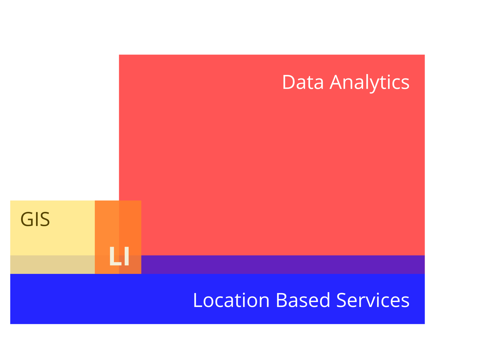<!-- .element class="noborder" style="max-height:480px"-->

Note:

En nuestra industria vemos como hay tres sectores tradicionales:

- El sector de los profesionales del análisis de los datos, un sector grande y maduro, que procesa enormes volúmenes de datos pero que no tienen ni idea de la componente espacial.

- El sector GIS tradicional, formado por profesionales muy técnicos y muy especializados.

- Los LBS como el sustento de aquellas organizaciones (algunas públicas pero sobre todo privadas) que generan la información de base que permite consumir mapas base y servicios de rutas, geocodifiación, áreas de interés, etc.

- Esta nueva disciplina, la inteligencia de la localización se encuentra en la intersección, apoyándose en los LBS un poco pero a caballo entre el sector del GIS tradicional y llevando la componente espacial al mundo de la analítica de datos.

---

---

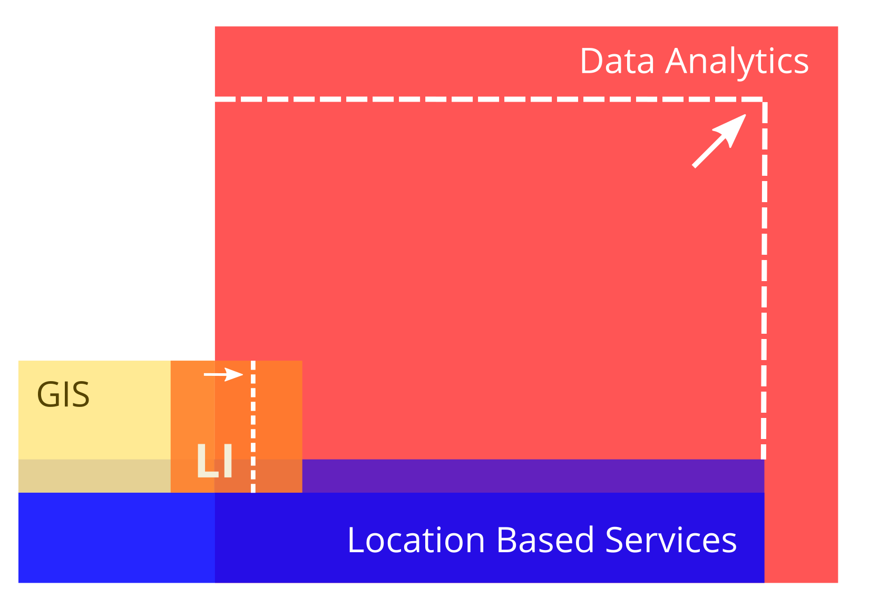<!-- .element class="noborder" style="max-height:480px"-->

Note:

Lo que estamos viendo es el sector de la analítica no para de crecer en retos y recursos, mientras que tanto los SIG como los servicios de datos se mantienen estables. Esta tracción de la analítica de datos se traslada también al Location Intelligence, que poco a poco entra más en ese mundo.

---

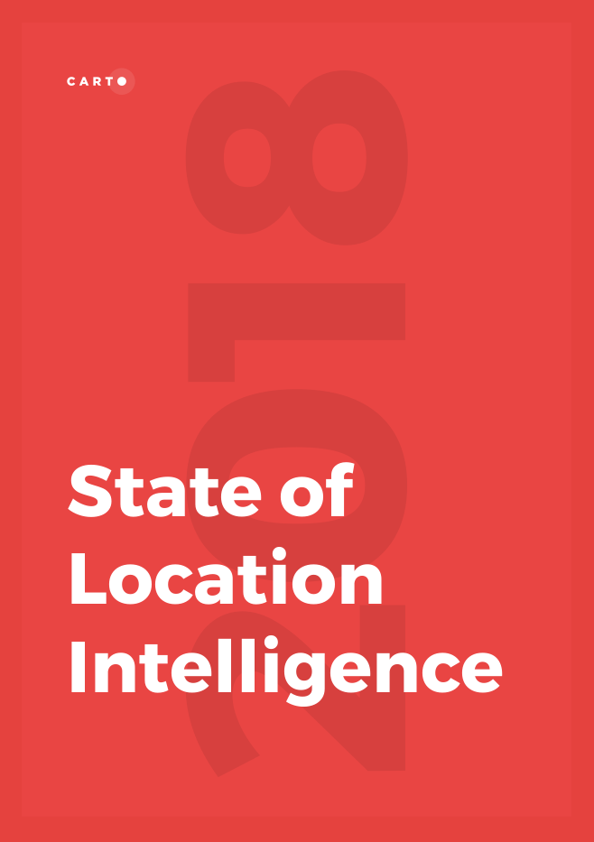<!-- .element style="max-height:480px"-->

---

## State of LI

* En colaboración con [Hanover Research](http://www.hanoverresearch.com/)
* Entrevistas a más de **200** ejecutivos y analistas
* Queríamos entender cómo ven la información geográfica y especialmente su **explotación**
* Disponible en [nuestra web](https://carto.com/state-of-location-intelligence-2018/)

---

## Ubicuidad

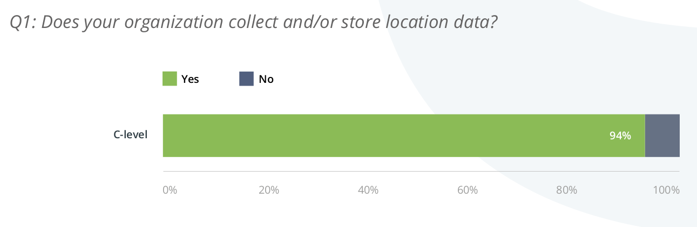

Note:

La práctica mayoría gestiona IG de algún tipo.

---

## Comprensión

Note:

2/3 creen que a día de hoy es muy relevante estudiar de forma adecuada el aspecto geográfico de los datos que recogen, el porcentaje aumenta al 85% al pensar a dos años vista.

---

## Inversión

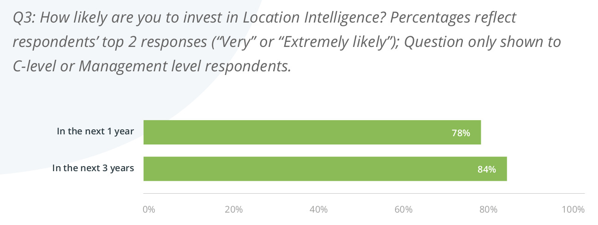

Note:

La gran mayoría creen que van a tener que invertir recursos en abordar el análisis de sus datos desde el punto de vista geográfico.

---

## Ejecutivos vs. analistas

Más **conciencia** en la dirección que entre los analistas

  * de la **importancia** de los datos geográficos
  * de los **retos** a afrontar

---

## Retos en la recolección

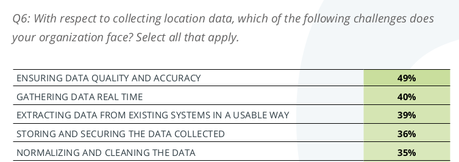

Note:

Al preguntarles por los retos en la recolección, la calidad y la recolección en tiempo real son sus mayores preocupaciones.

---

## Retos en el análisis

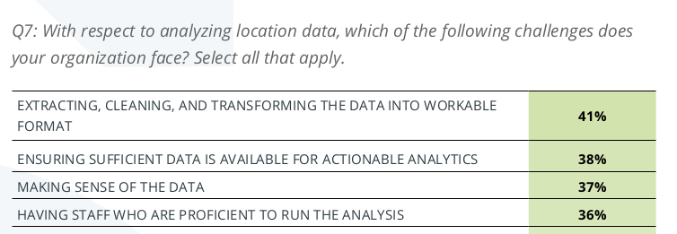

Note:

en el análisis de los datos les preocupa la transformación de los mismos en un formato que sea usable, así como disponer de suficientes datos y de ser capaces de entenderlos.

---

## Cómo usan los datos geográficos

* Mayoría en niveles administrativos   entre **país** y **código postal**
* **&frac13;** usan **planos** de sus instalaciones
* **&frac14;** trabajan con puntos en **Lon/Lat**

Note:

Solo una cuarta parte utilizan información puntual, la gran mayoría trabajan agregando de código postal para arriba.

---

## Cómo usan los datos geográficos

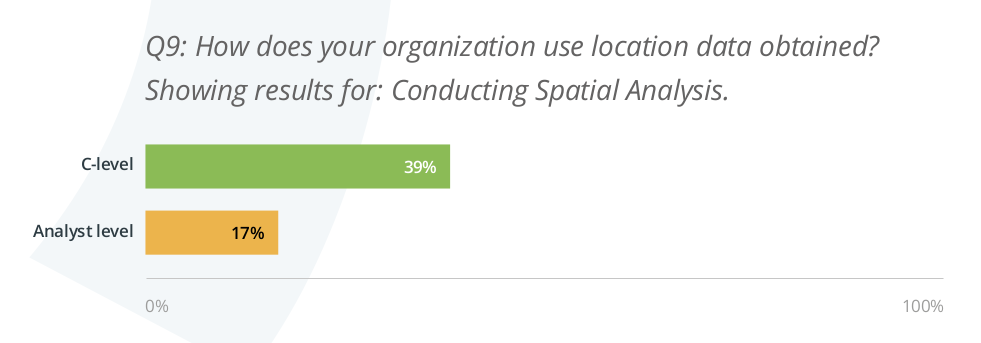

Note:

Los analistas usan los datos en menor medida de lo que creen sus jefes.

---

## Conclusión principal

> Hay todavía mucho margen para la explotación de los datos geográficos en las organizaciones

---
<!-- .element data-background="../resources/carto/wallpapers/prediction-blue.png" class="only-background"-->

Note:

Cambio de tercio, hemos visto cómo actualmente las empresas no están utilizando todo el potencial, pero trabajando en CARTO tenemos la suerte de poder ser testigos de como muchas organizaciones sí lo hacen, algunas con nuestra ayuda.

---
<!-- .element data-background="imgs/matt-milton-43830.jpg" class="dark-background"-->

## El internet de las cosas

- 2017: **8.400** millones de dispositivos
- 2020: **20.400** millones de dispositivos

Note:

[Fotografía](https://unsplash.com/photos/GNPCLcjaJJ0)

---

<!-- .element style="width:40%" -->

* **Monitorización** de actividades deportivas
* Gamificación, comunidades, etc.

---

## Actividad

---

## Grupos

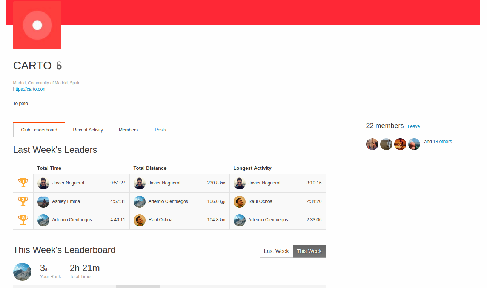

---

## Mapa de calor de actividad

[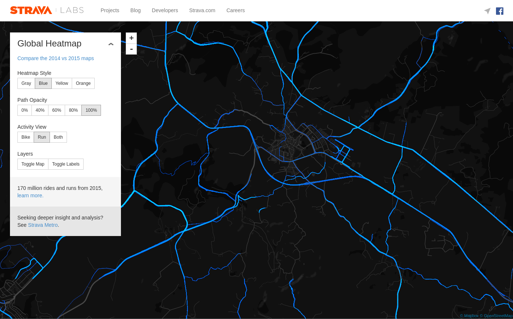](http://labs.strava.com/heatmap/#14/4.13215/39.92916/blue/run)

---

## Densificación de OSM

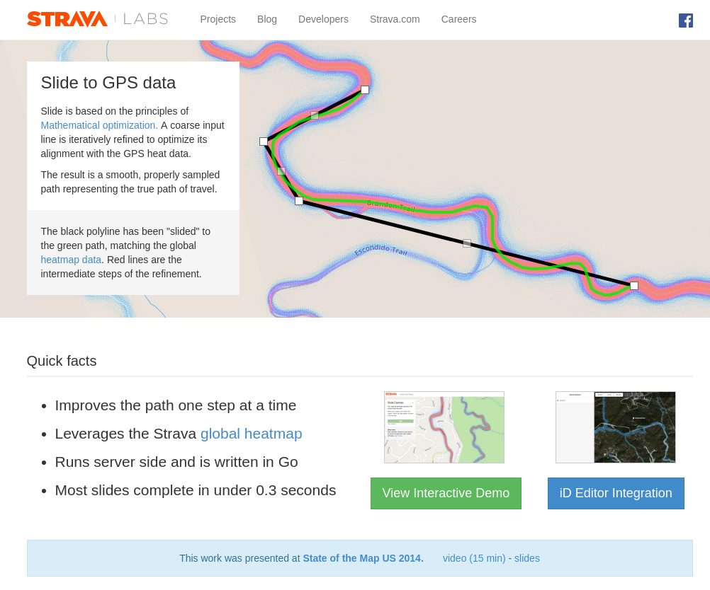

http://labs.strava.com/slide/

---

## Mapbox

- La mayoría de proveedores de LBS  recogen datos de sus usuarios
- SDK móvil de Mapbox

<!-- .element style="width:50%" -->

---

## Mapbox

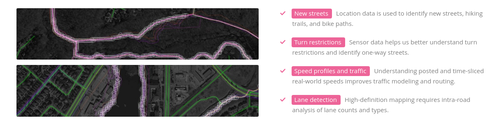

https://www.mapbox.com/telemetry/

---

## Turismo en Barcelona

[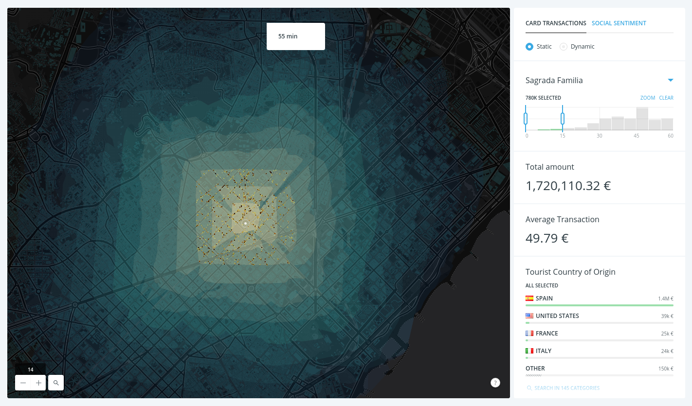](http://mwctourism.cartodb.io/index.html?lat=41.398380835943385&lng=2.1636199951171875&zoom=14)

---

## Old Weather

<iframe width="560" height="315" src="https://www.youtube.com/embed/GFuOVoex7tE?rel=0&amp;start=16" frameborder="0" allowfullscreen></iframe>

Note:

Durante la 1GM se recogieron en forma de bitácoras de buques de guerra centenares de miles de registros. Mediante una plataforma de colaboración ciuaddana se han transcrito y codificado.

---

## Old Weather

<iframe src="https://player.vimeo.com/video/208672551" width="640" height="360" frameborder="0" webkitallowfullscreen mozallowfullscreen allowfullscreen></iframe>

Note:

Se ha conseguido incorporar a las bases de datos meteorológicas toda esta información recopilada a lo largo de varios años.

---

## Old Weather

<iframe src="https://player.vimeo.com/video/128684414" width="640" height="365" frameborder="0" webkitallowfullscreen mozallowfullscreen allowfullscreen></iframe>

https://blog.oldweather.org/results/

---

## Transporte ilegal de pescado

[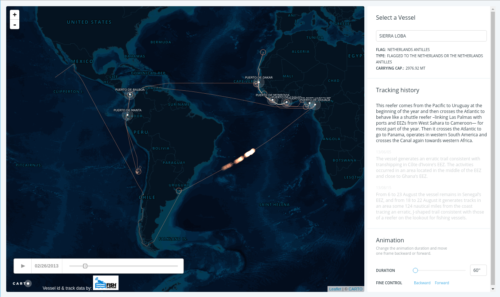](https://s3-eu-west-1.amazonaws.com/odi-static-projects/illegal-fishing/index.html#9120217/4/-13.75/-35.99)

[Informe](https://www.odi.org/publications/10459-western-africas-missing-fish-impacts-illegal-unreported-and-unregulated-fishing-and-under-reporting)

---

## Datos de telefonía · LUCA

De casa al trabajo en Madrid

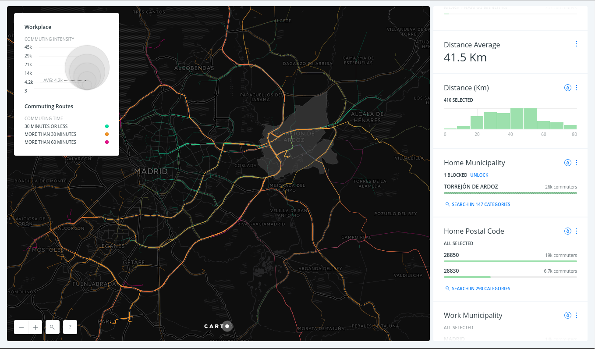

---

## Urban Discovery · BBVA

Caracterización de zonas

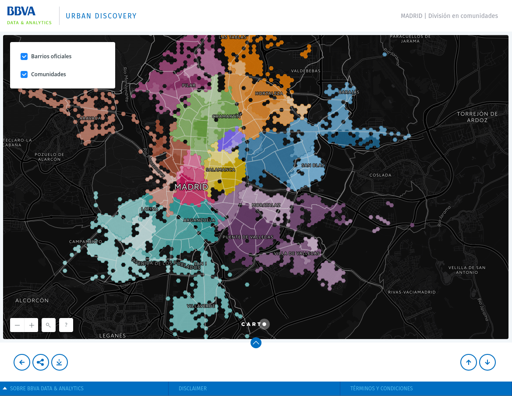<!-- .element style="width:55%" -->

https://www.bbvadata.com/urbandiscovery

---

## I nteriores · Tempo

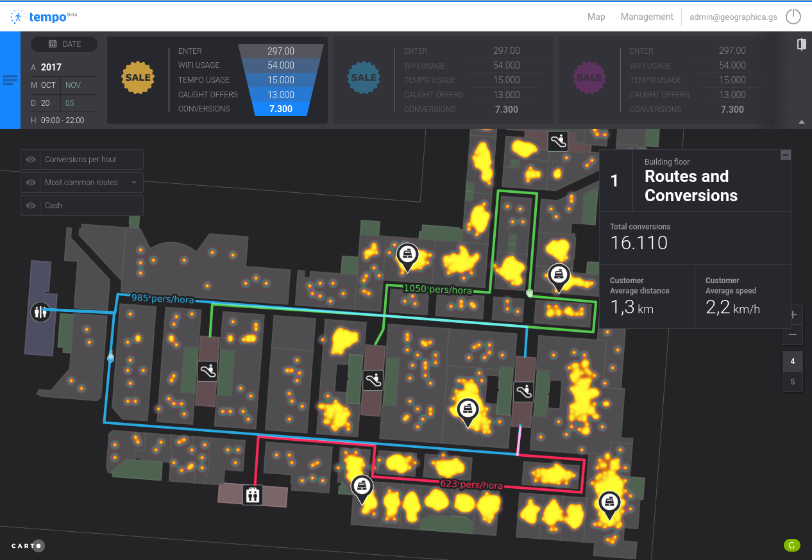

https://geographica.gs/es/blog/servicios-predictivos/

---

## Vigilancia forestal y crowdsourcing

<iframe width="560" height="315" src="https://www.youtube.com/embed/lTG-0brb98I?rel=0" frameborder="0" allowfullscreen></iframe>

---

## globalforestwatch.org

* Monitorización en tiempo real de cobertura forestal
* Usuarios pueden *vigilar* una zona

[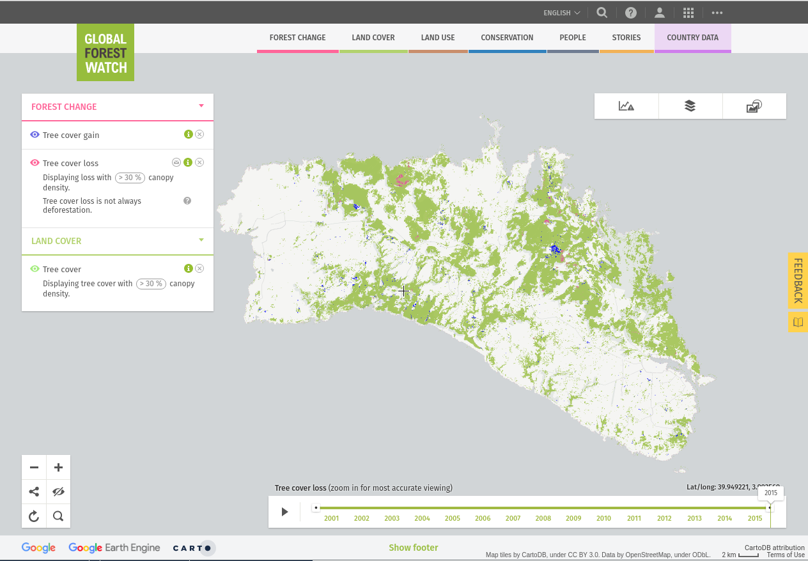](http://bit.ly/2xWUVkU)

---

## Forest Watcher

<iframe width="560" height="315" src="https://www.youtube.com/embed/fjp0Ikw3gNQ?rel=0" frameborder="0" allowfullscreen></iframe>

---

## Para terminar

Un par de recomendaciones

* [Podcast](https://99percentinvisible.org/episode/the-age-of-the-algorithm/) sobre los peligros de los algoritmos
* Ráfagas en [inglés](https://geoinquiets.github.io/rafagas/) o [catalán](https://lists.osgeo.org/listinfo/barcelona)

---

## GRÀCIES

Jorge Sanz · jorge@carto.com · 2017-08-16

[bit.ly/1710-fuentes-loc](http://bit.ly/1710-fuentes-loc)

