## CARTO as a Platform

|   |   |
|:--|--:|
| `Space`, `Page Forward` or `→` | forward |
| `Page Back` or `←`             | back  |
| `S`                        | notes |
| `Esc`                      | overview |
| `F`                        | full screen |


---


# CARTO as a Platform

<!-- .element style="font-size:1.7em"-->

Jorge Sanz · [@xurxosanz](https://twitter.com/xurxosanz) · jorge@carto.com

[bit.ly/1803-carto-platform](http://bit.ly/1803-carto-platform)


Note:

### Abstract:

CARTO is a successful service and Open Source product stack used by organizations of all sizes and verticals. Its portfolio is mainly divided into two main products: BUILDER and ENGINE. This talk is about the latter, exploring how to use the CARTO platform to develop your geospatial applications with a complete set of services, APIs, and client components.

First, we’ll focus on the APIs and Location Data Services offered by CARTO and our plans to evolve them in 2018. Secondly, we’ll cover our JavaScript SDK: CARTO.js. This brand new library offers a different approach; more developer focused and low-level. Finally, we will discuss CARTO for Python developers, with our Python SDK and the CARTOFrames library we’ve created on top  to enable direct integration with Pandas and Jupyter Notebook, the increasingly popular environment for Data Scientists.


---

<!-- .element data-background="../resources/carto/wallpapers/prediction-blue.png"  class="only-background"-->

---

<!-- .element data-background="../resources/images/city.png" class="only-background"-->


### **CARTO** IS THE PLATFORM FOR TURNING LOCATION DATA INTO BUSINESS OUTCOMES

Note:

CARTO is an offering for organizations and individuals to obtain value from geospatial information. That offering is formed by technology stack that will review in a minute.

___

<!-- .element data-background="../resources/images/jefferson-santos-450403-unsplash.jpg" -->

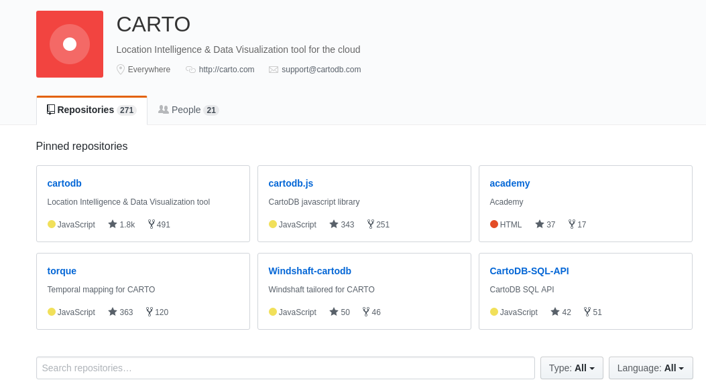

[github.com/CartoDB](https://github.com/CartoDB)

Note:

But CARTO is also an Open Source effort, we develop CARTO in our GitHub organization, and these are the main repositories. Let's take a look to the main repository statistics.
___

<!-- .element data-background="../resources/images/jefferson-santos-450403-unsplash.jpg" -->

`CartoDB/cartodb` metrics

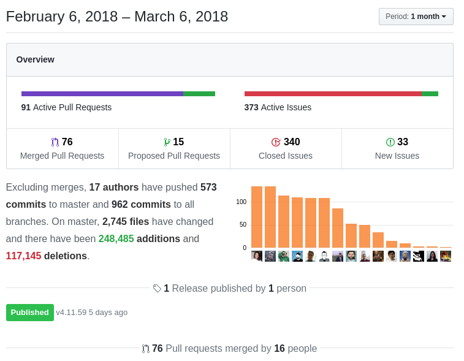

Note:

Overview of the last month, with 76 pull requests merged and 15 in the works.

Side note, we had 340 closed issues because we deployed a bot to get rid of the inactive ones.
___

<!-- .element data-background="../resources/images/jefferson-santos-450403-unsplash.jpg" -->

`CartoDB/cartodb` metrics

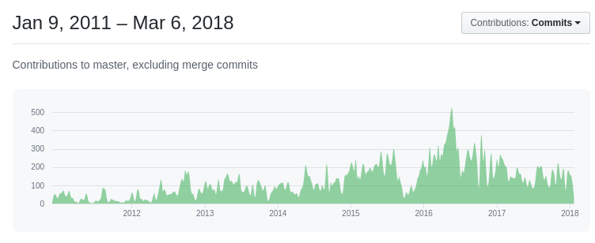

Note:

Contributions to master since 2011

___

<!-- .element data-background="../resources/images/jefferson-santos-450403-unsplash.jpg" -->

`CartoDB/cartodb` metrics

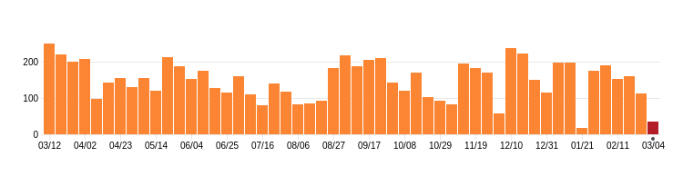

Only a few commits during the company retreat =)  <!-- .element: style="font-size:smaller;" class="fragment" -->

Note:

Commits to any branch over the last year
___


<blockquote style="width:80%;font-size:smaller;"><p lang="en" dir="ltr">22 Pull Requests. That&#39;s how many <a href="https://twitter.com/CARTO?ref_src=twsrc%5Etfw">@CARTO</a> teammates have made to non-CARTO-owned open source projects in roughly the last month, including <a href="https://twitter.com/mapnikproject?ref_src=twsrc%5Etfw">@mapnikproject</a> , <a href="https://twitter.com/postgis?ref_src=twsrc%5Etfw">@postgis</a> and <a href="https://twitter.com/OSGeo?ref_src=twsrc%5Etfw">@OSGeo</a> projects. Glad to be at a company that practices open source!</p>&mdash; Andrew Thompson (@andrewbt) <a href="https://twitter.com/andrewbt/status/971523061517348864?ref_src=twsrc%5Etfw">March 7, 2018</a></blockquote>

___

<!-- .element data-background="../resources/images/carto-pioneers.png" class="only-background"-->

Note:

As a company we managed to get around 300 thousand users, 1200 paying customers and a strong network of partners.
___

<!-- .element data-background="../resources/images/carto-team-map.png" class="only-background"-->

___

<!-- .element data-background="../resources/images/carto-retreat.jpg" class="only-background"-->

___

<!-- .element data-background="../resources/images/josh-bean-348474-unsplash.jpg" class="only-background"-->

# CARTO portfolio

## BUILDER + **ENGINE**

Note:

Our portfolio is basically splitted into BUILDER and ENGINE.

* BUILDER is a full application to create dashboards and visualization that analyze and publish your geospatial data.
* ENGINE is the platform that supports BUILDER and any custom application you want to create with the data stored in your account.

___

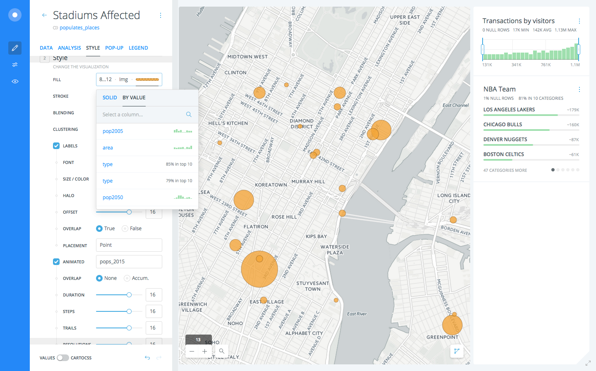

* **Visualization** and easy styling
* **Analysis** workflow (no SQL needed)
* **Dashboards** with widgets and interactivity

Note:

* BUILDER allows to create great visualizations, giving your geospatial data proper styling for thematic webmapping.
* You don't need to be a SQL expert to create complex analysis workflows with BUILDER, everything is visual (but you can use SQL if you want).
* BUILDER allows to create real geospatial applications as dashboards that using widgets allow your users to interact with your data to learn and discover.

---

<!-- .element data-background="../resources/carto/wallpapers/location-red.png" class="only-background"-->

---

<!-- .element data-background="../resources/carto/wallpapers/igor-ovsyannykov-252351-unsplash.jpg" class="only-background"-->

# **ENGINE**

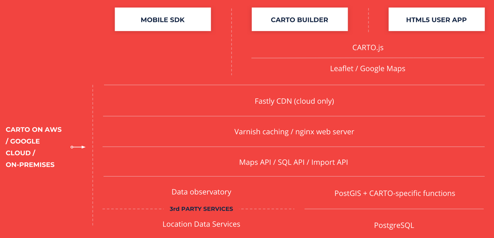 <!-- .element style="width:800px;" -->

Note:

The technology stack in CARTO is like this, 

* we have at the data layer Postgres and PostGIS but also other services that can enrich your data with demographic information, routing, and so on.
* on top of it a set of APIs that allow to interact with your data to import information, render tiles, get raw results, etc
* above we have the web and caching servers and in our cloud, a smart CDN that makes maps fast and easy to consume even on demanding scenarios like election maps
* at the user level, besides BUILDER we have the different clients and development kits to interact with the platform as we'll see later.

___

## Components

- Fundamentals
- APIs
- Data Observatory
- Libraries
- Other tools

Note:

CARTO ENGINE can be understood as different groups of components.

* Shared components are what we call the fundamentals of the platform
* A set of APIs to interact with CARTO geospatial data in different ways
* A centralized repository of geospatial data that can be consumed by our users (it's actually a full Open Source project on its own)
* A group of libraries and development kits
* Other tools to help on the styling or the management of your information.

Let's go over them

___

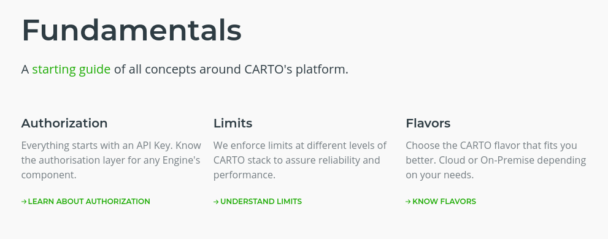

Note:

* A new **Authorization API**, more granular permissions
* Enforced **limits**, so our platform is reliable and predictable
* Flavors
  * Enterprise
  * On-premises
  * A CARTO Open Source succesfull installation is exactly the same as an OnPrem


---

<!-- .element data-background="../resources/carto/wallpapers/purple.png" class="only-background"-->

---

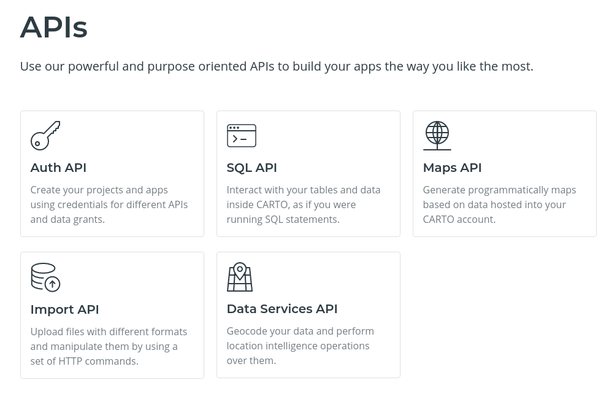

___

## SQL API

[https://{user}.carto.com/api/v2/sql?q={query}](https://jsanz.carto.com/api/v2/sql?q=SELECT+name,pop_max+FROM+populated_places+ORDER+BY+pop_max+DESC+LIMIT+5)

* With an API key you can run
  * `UPDATE`, `DELETE`, `CREATE ...`
* Allows different **formats**
  * CSV, GeoJSON, GeoPackage
* **Async** version for long queries

Note:

The SQL API is a thin wrapper around the database to allow you to interact with your account basically as if you had direct access to it. You can also use it as an export API to extract full tables or processed datasets.

___

## Import API

```
curl -v -F file="@/path/to/file" \
"https://{account}.carto.com/api/v1/imports/?api_key={API Key}"
```

* Create tables from **local** and **remote** resources
* For remote resources, programmed import is possible (**sync table**)
* **Connectors** to databases and other data repositories

Note:

The Import API is our main ETL tool. With the Import API you create new tables from local files in many different formats, but also can pull data from public URLs. We recently implemente connectors so apart from regular files, you can connect with databases (MySQL or Oracle for example) and big data repositories (Hive or Amazon Redshift) in almost the same way. For both files and connectors, you can define your table to be refreshed periodically so your data can stay synced with external data sources.
___

## Data Services API

* **SQL** functions
* Different data **providers** (Mapbox, HERE)
* Routing, geocoding, isolines

Note:

The data services API is actually a set of SQL functions that interact with a central component that depending on the account configuration will use one of the available location based services providers. This is built this way so we can account the usage of these services as we are later billed for them.

The services provide geocoding, routing and isolines analysis.
___

### Geocoding

```
 % curl -s "http://{username}.carto.com/api/v2/sql?" \
--data-urlencode "api_key={api_key}" \
--data-urlencode "q=SELECT ST_AsText(cdb_geocode_street_point('1 Sekforde St','London', 'United Kingdom'))"
```
<!-- .element style="font-size:0.6em;" -->
```json
{
  "st_astext": "POINT(-0.1048 51.52413)"
}
```

Note:

Here we have a cURL request to get the coordinates of the Conference Venue based in the postal address. I hope that's correct!

___
<!-- .element data-background="imgs/routing.png" class="only-background"-->
___

## Maps API

* **Renders** assets
  * Raster/Vector/Torque tiles
  * UTF grids
  * Static images
  * **Public** and **Private** data
* Supports **TileJSON** format
* **Aggregations** on the fly
* **CartoCSS** to define your cartography styles

___

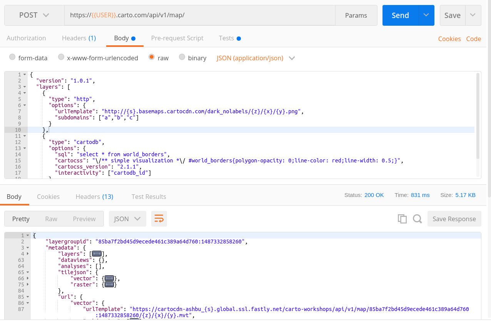

[Demo: Maps API and Mapbox.GL](https://codepen.io/jsanz/pen/mXbVXd?)

---

<!-- .element data-background="../resources/carto/wallpapers/navy-blue.png" class="only-background"-->

---

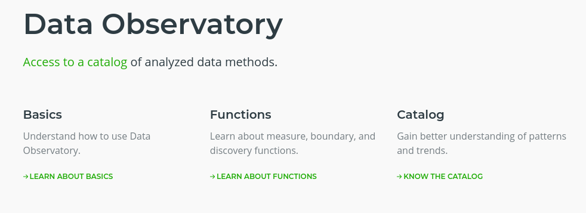

https://github.com/CartoDB/bigmetadata
___

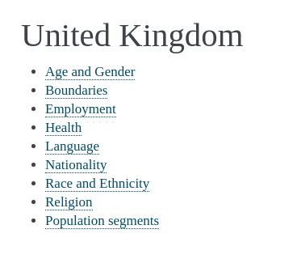
___

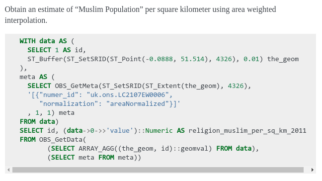

Note:

Example on how to query the DO to get the Muslim population normalized by area. The query looks complicated but it's basically creating a circle and then pulling data for that measurement, asking to be normalized by area and finally putting those two concepts together to get the final result.
___

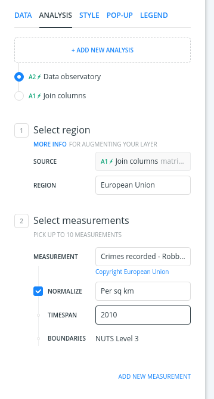

Note:

Still, we have a nice interface in BUILDER, remember no SQL needed :-)

---

<!-- .element data-background="../resources/carto/wallpapers/location-red.png" class="only-background"-->

---

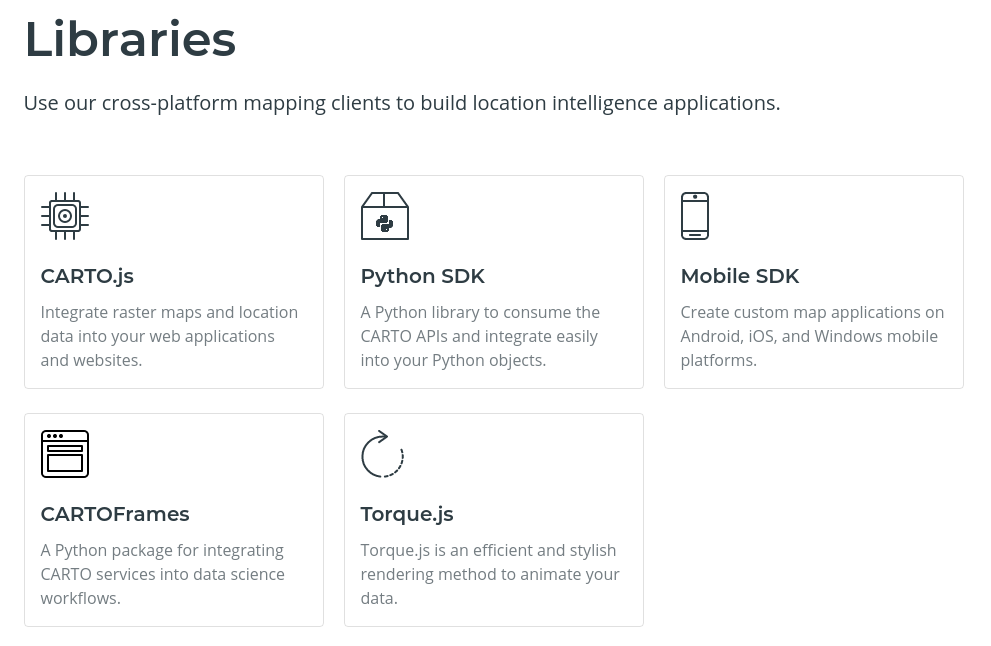

___

## Mobile SDK

* https://github.com/CartoDB/mobile-sdk
* Platforms supported: **Android**, **iOS**
* Focused in both **offline** and **online** resources
* Basemaps, routing, geocoding

___

## Python SDK

* https://github.com/CartoDB/carto-python
* **Wrapper** for the Import, SQL and Maps API
* Base for middleware **integrations**

___

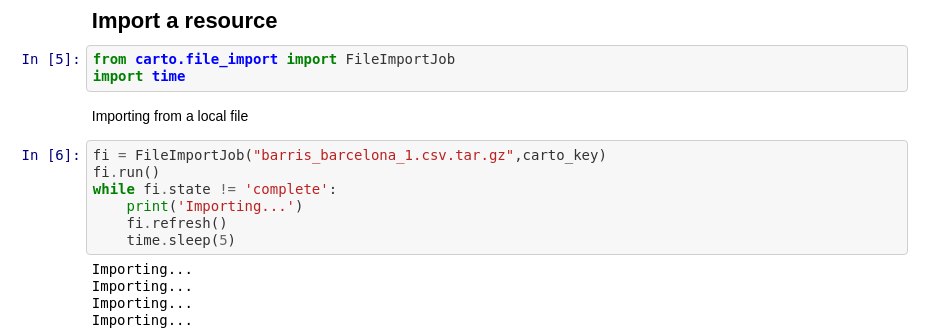

[Examples](https://github.com/CartoDB/carto-workshop/blob/master/06-sdks/exercises/python_SDK/Python_SDK_2.ipynb)

___

## CartoFrames

* https://github.com/CartoDB/cartoframes
* https://carto.com/blog/inside/CARTOframes-python-interface-CARTO/
* **Jupyter** and **Pandas** are becoming standards for Data Scientists
* We want them to use CARTO without leaving their tools
* Pandas **DataFrame** integration and **Leaflet** inside Jupyter
___

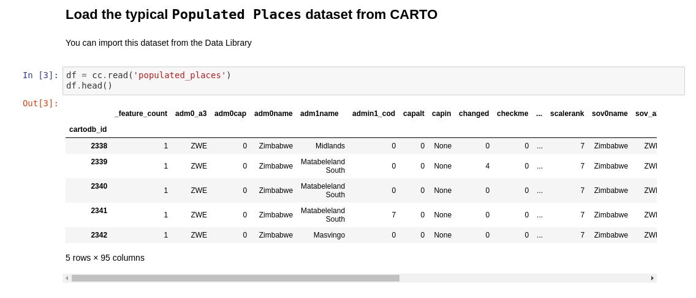

[Example](http://nbviewer.jupyter.org/github/CartoDB/carto-workshop/blob/master/06-sdks/exercises/python_SDK/CARTO_Frames.ipynb)
___

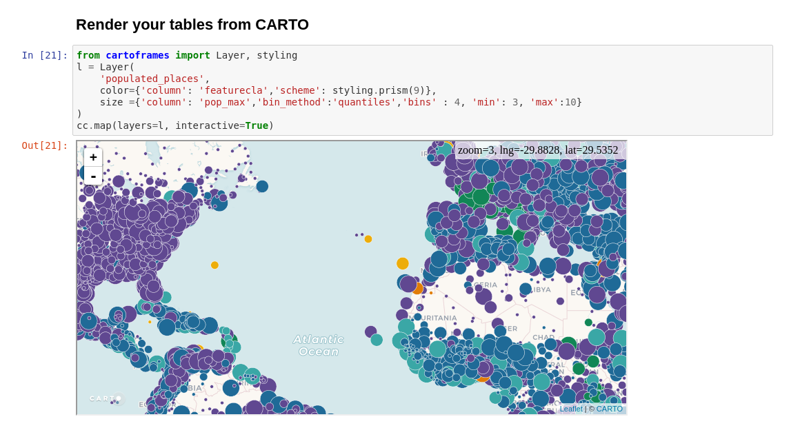

[Example](http://nbviewer.jupyter.org/github/CartoDB/carto-workshop/blob/master/06-sdks/exercises/python_SDK/CARTO_Frames.ipynb)
___

## CARTO.js

* https://github.com/cartodb/cartodb.js/tree/v4 (to be relased soon)
* **Low-level** approach, dev friendly and easier to integrate
* Supports **Leaflet** and **Google Maps**
* Focused in **raster** tiles
* **Dataviews** (widgets model), dynamic **legends** and **metadata**
* New [documentation](https://carto.com/documentation/cartojs/) with full [API](https://cartodb.github.io/documentation/carto-js/reference/) and examples

___


https://carto.com/blog/inside/cartojs-and-react/

---

<!-- .element data-background="../resources/carto/wallpapers/prediction-blue.png"  class="only-background"-->

---

# **2018**


___

## **Mature** the platform

* Enforce limits
* Authentication API
* Develop better metrics

___

## Focus on **performance**

* Aggregation methods [&raquo;](https://carto.com/blog/inside/tile-aggregation/)
* JS library for vector tiles
* Upgrade to Postgres 10 and PostGIS 2.4 [&raquo;](https://carto.com/blog/inside/the-5x-project/)
* Vector tiles without Mapnik · `ST_AsMVTGeom()` [&raquo;](https://carto.com/blog/inside/MVT-mapnik-vs-postgis/)
___

## Developer **happiness**

* New developer center [&raquo;](https://cartodb.github.io/documentation/)
  * better organization, guides, examples
* Automated API documentation [&raquo;](https://cartodb.github.io/documentation/carto-js/reference/)

---

<!-- .element data-background="../resources/carto/wallpapers/purple.png" class="only-background"-->

---


___

## Thanks!

Jorge Sanz · [@xurxosanz](https://twitter.com/xurxosanz) · jorge@carto.com

[bit.ly/1803-carto-platform](http://bit.ly/1803-carto-platform)


