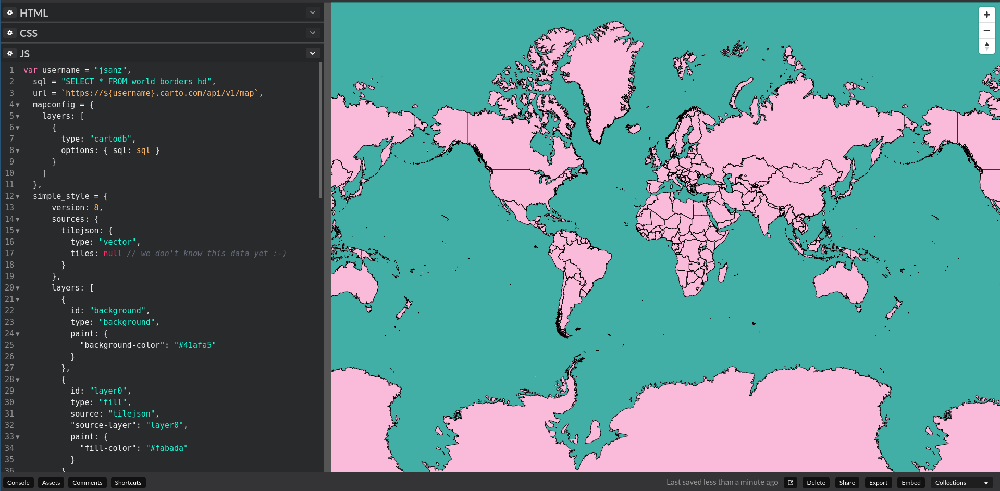
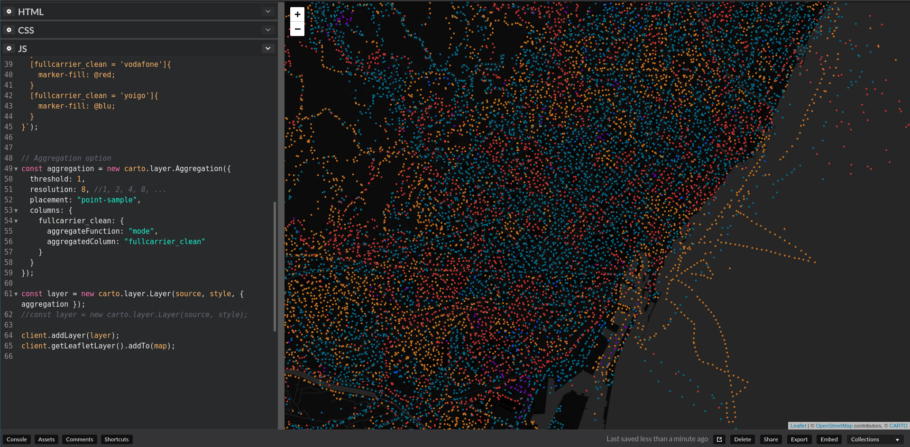
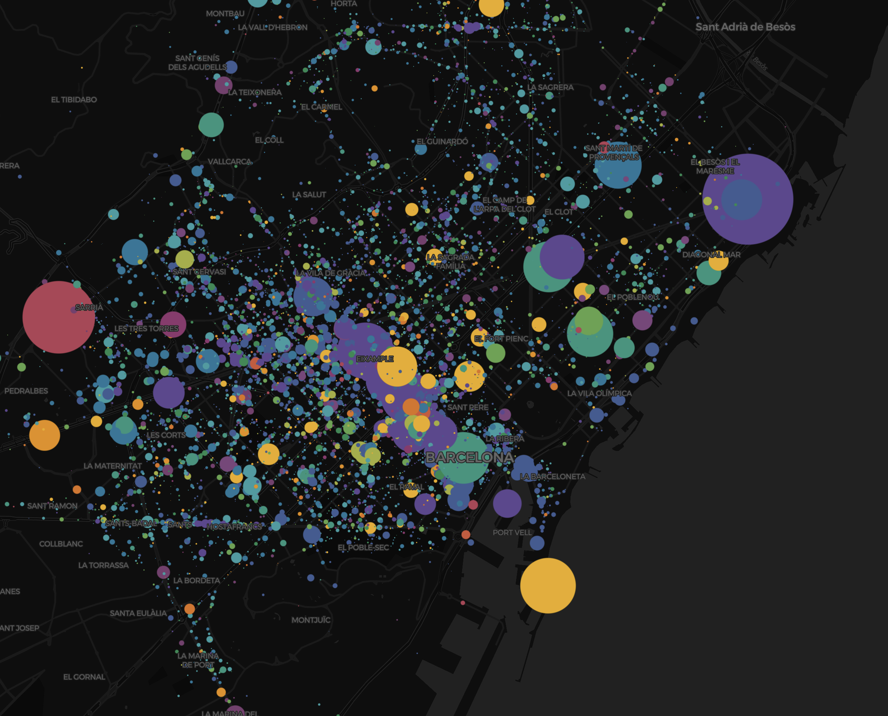
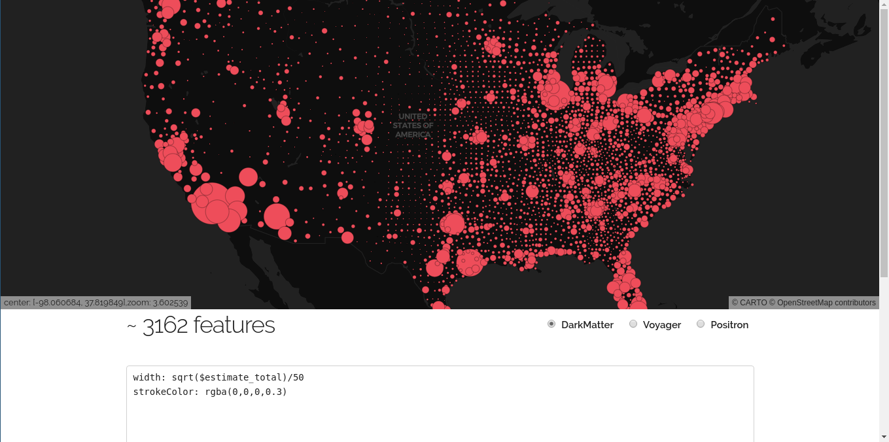
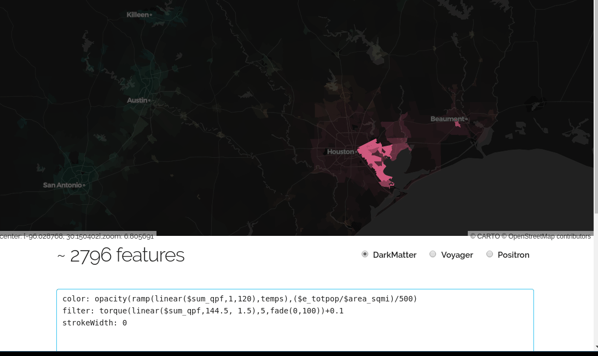
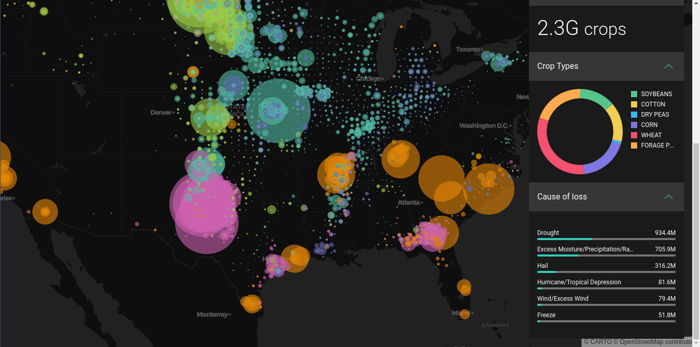

## CARTO ENGINE 2018

|   |   |
|:--|--:|
| `Space`, `Page Forward` or `→` | forward |
| `Page Back` or `←`             | back  |
| `S`                        | notes |
| `Esc`                      | overview |
| `F`                        | full screen |

---

# CARTO ENGINE 2018

<!-- .element style="font-size:1.7em"-->

Jorge Sanz · [@xurxosanz](https://twitter.com/xurxosanz) · jorge@carto.com

[bit.ly/180607-engine](http://bit.ly/180607-engine)


Note:

### Abstract:

CARTO is a successful service and Open Source product stack used by organizations of all sizes and verticals. Its portfolio is mainly divided into two main products: BUILDER and ENGINE. This talk is about the latter, exploring how to use the CARTO platform to develop your geospatial applications with a complete set of services, APIs, and client components.

---

<!-- .element data-background="../resources/carto/wallpapers/navy-blue.png" class="only-background"-->

---

<!-- .element data-background="../resources/images/igor-ovsyannykov-252351-unsplash.jpg" class="only-background"-->


 <!-- .element style="width:800px;" -->

Note:

The technology stack in CARTO is like this, 

* we have at the data layer Postgres and PostGIS but also other services that can enrich your data with demographic information, routing, and so on.
* on top of it a set of APIs that allow to interact with your data to import information, render tiles, get raw results, etc
* above we have the web and caching servers and in our cloud, a smart CDN that makes maps fast and easy to consume even on demanding scenarios like election maps
* at the user level, besides BUILDER we have the different clients and development kits to interact with the platform as we'll see later.

---


https://carto.com/developers/


---

<!-- .element data-background="../resources/images/lena-bell-68534-unsplash.jpg" -->

## Maps API

* Supports raster and **vector** tiles
* Supports **TileJSON** format
* Smart **aggregations** on the fly

---



[Demo: Maps API, vector tiles and Mapbox.GL](https://codepen.io/jsanz/pen/mXbVXd?)

---



[Demo: Maps API, smart aggregation and CARTO.js 4](https://codepen.io/jsanz/pen/yvebrg?editors=0010)

---

## CartoFrames

* https://github.com/CartoDB/cartoframes
* https://carto.com/blog/inside/CARTOframes-python-interface-CARTO/
* **Jupyter** and **Pandas** are becoming standards for Data Scientists
* We want them to use CARTO without leaving their tools
* Pandas **DataFrame** integration and **Leaflet** inside Jupyter
---


[Example](http://nbviewer.jupyter.org/github/CartoDB/carto-workshop/blob/master/06-sdks/exercises/python_SDK/CARTO_Frames.ipynb)
---


[Example](http://nbviewer.jupyter.org/github/CartoDB/carto-workshop/blob/master/06-sdks/exercises/python_SDK/CARTO_Frames.ipynb)

---

## CARTO.js

* https://github.com/CartoDB/carto.js
* **Low-level** approach, dev friendly and easier to integrate
* Supports **Leaflet** and **Google Maps**
* Focused in **raster** tiles
* **Dataviews** (widgets model), dynamic **legends** and **metadata**
* New [documentation](https://carto.com/documentation/cartojs/) with full [API](https://cartodb.github.io/documentation/carto-js/reference/) and examples

---


https://carto.com/blog/inside/cartojs-and-react/


---

## CARTO VL

* https://github.com/CartoDB/carto-vl
* **Vector** rendering JavaScript library
* Fully **integrated** with CARTO ENGINE
* New **styling** language
* **Animations** for points, lines and polygons
* Can work on top of **Mapbox GL**
* Does not replace **CARTO.js**
* **Beta** release!!
---

### String API

```js
new carto.Viz(`
 width: sqrt(SUM($amount))
 color: ramp(MODE($category), prism)
`);
```

### JavaScript API

```js
new carto.Viz({
  width: s.sqrt(s.sum(s.prop('amount'))),
  color: s.ramp(
    s.mode(s.prop('category')),
    s.palettes.prism
  )
});
```

---



---



[Demo: expressions](https://cartodb.github.io/carto-vl/examples/editor/index.html#eyJhIjoiY291bnR5X3BvaW50c193aXRoX3BvcHVsYXRpb25cbiIsImIiOiIiLCJjIjoibWFtYXRhYWtlbGxhIiwiZCI6Imh0dHBzOi8ve3VzZXJ9LmNhcnRvLmNvbSIsImUiOiJ3aWR0aDogc3FydCgkZXN0aW1hdGVfdG90YWwpLzUwXG5zdHJva2VDb2xvcjogcmdiYSgwLDAsMCwwLjMpXG5cblxuXG5cbiIsImYiOnsibG5nIjotOTguMDYwNjg0MjUzNDcxMTUsImxhdCI6MzcuODE5ODQ4NTc5MjUxNDd9LCJnIjozLjYwMjUzODcwMjU2Mzg1NCwiaCI6IkRhcmtNYXR0ZXIifQ==)

---



[Demo: animated polygons](https://cartodb.github.io/carto-vl/examples/editor/index.html#eyJhIjoidGFibGVfMzAiLCJiIjoiIiwiYyI6ImNhcnRvZ2wiLCJkIjoiaHR0cHM6Ly97dXNlcn0uY2FydG8uY29tIiwiZSI6ImNvbG9yOiBvcGFjaXR5KHJhbXAobGluZWFyKCRzdW1fcXBmLDEsMTIwKSx0ZW1wcyksKCRlX3RvdHBvcC8kYXJlYV9zcW1pKS81MDApXG5maWx0ZXI6IHRvcnF1ZShsaW5lYXIoJHN1bV9xcGYsMTQ0LjUsIDEuNSksNSxmYWRlKDAsMTAwKSkrMC4xXG5zdHJva2VXaWR0aDogMCIsImYiOnsibG5nIjotOTYuMDI4NzY3NjA3MDM5MywibGF0IjozMC4xNTA0MDE1NDE5MDMwNX0sImciOjYuODA1NjkwNTg4OTk2OTI1LCJoIjoiRGFya01hdHRlciJ9)

---



[Demo: carto-vl + widgets](https://cartovl-airship-hptcvxelnr.now.sh/)


---
<!-- .element data-background="../resources/carto/wallpapers/purple.png" class="only-background"-->

---

<!-- .element data-background="../resources/images/city.png" -->

## Thanks!

Jorge Sanz · [@xurxosanz](https://twitter.com/xurxosanz) · jorge@carto.com

[bit.ly/180607-engine](http://bit.ly/180607-engine)


---

## Pictures attributions

<ul>
<li><a href="https://unsplash.com/photos/9SoCnyQmkzI">Jefferson Santos</a></li>
<li><a href="https://unsplash.com/photos/Gecsh_1GOz4">Josh Bean</a></li>
<li><a href="https://unsplash.com/photos/HFG53IIJ8y0">Igor Ovsyannykov</a></li>
<li><a href="https://unsplash.com/photos/mluSdDeOksc">Lena Bell</a></li>
<li><a href="https://unsplash.com/photos/iPt41beW5rs">Thomas Kelley</a></li>
<li><a href="https://unsplash.com/photos/OPzWvgL-upY">Giammarco Boscaro</a></li>
</ul>
