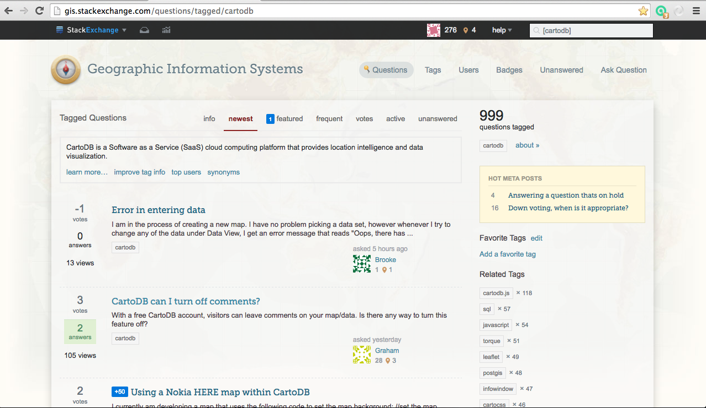
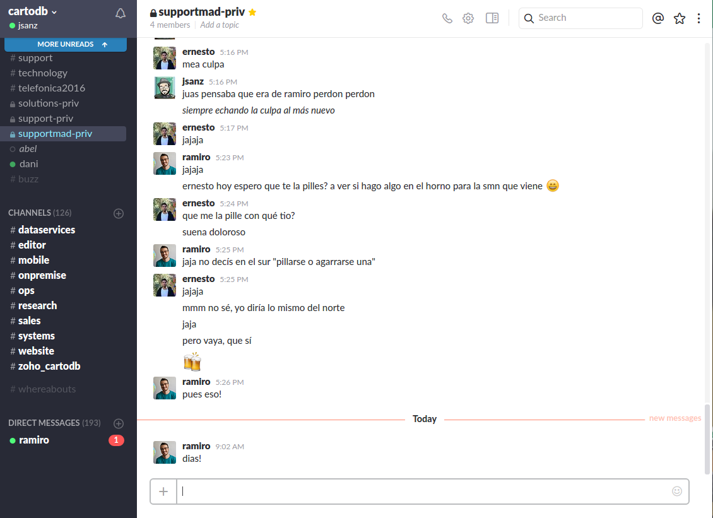
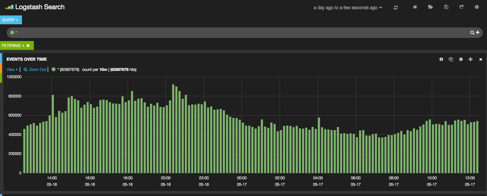
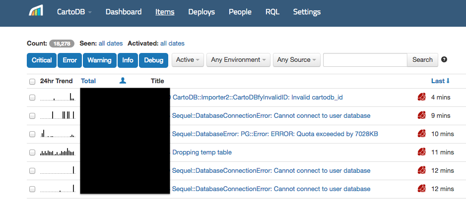
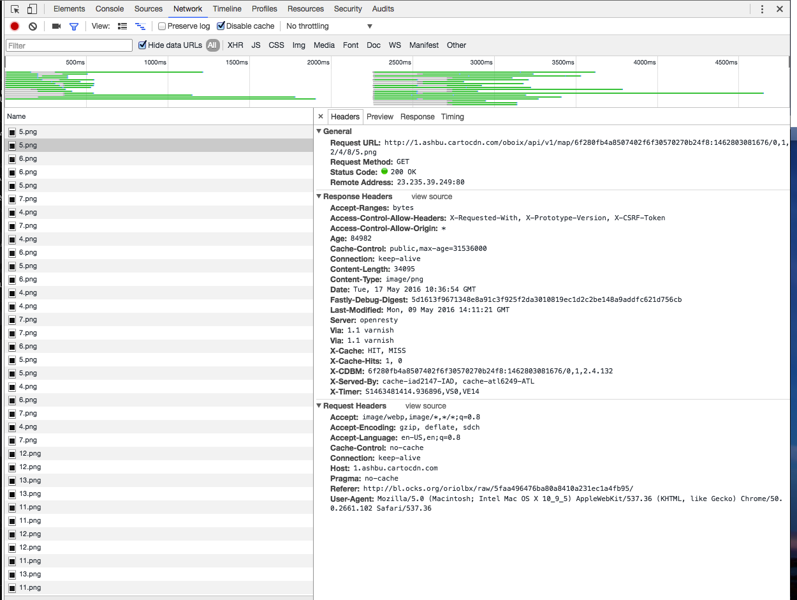

How to give professional support to users in a Cloud geospatial service
========================================================================

Oriol Boix ([@oriolbx](https://twitter.com/oriolbx)), Jorge Sanz([@xurxosanz](https://twitter.com/xurxosanz))

[10as Jornadas SIG libre](http://www.sigte.udg.edu/jornadassiglibre/en/)
24/05/2016

___

## Agenda

* CartoDB: Cloud geospatial service
* Support team
* Who do we give support to?
* How is support given?
* Support evaluation

---

# CartoDB: Cloud geospatial service

</img>

___

___

 <!-- .element: style="width:45%;" -->
---
# Support Team

> This is great. Thank you And, thanks for saying "you know what, we're not there yet. But, here's what you can do for yourself..." **I've run a lot of product organizations in the past, and great tech support is key to bringing new customers up.** Thanks.

___

<iframe src="https://team.cartodb.com/u/jsanz/viz/4ddc4fd8-fcb5-11e5-914a-0ef7f98ade21/embed_map?zoom=3&center_lat=46&center_lon=-30" width="100%" height="500px"></iframe>

___

## Madrid (UTC/GMT +2 hours)

<!-- .element: style="width:45%;" -->

___

## Madrid (UTC/GMT +2 hours)

<!-- .element: style="width:45%;" -->

___

## Madrid (UTC/GMT +2 hours)

<!-- .element: style="width:45%;" -->

___

## Madrid (UTC/GMT +2 hours)

 <!-- .element: style="width:45%;" -->

___
## New York (UTC/GMT -4 hours)

<!-- .element: style="width:45%;" -->
___

## California (UTC/GMT -7 hours)

<!-- .element: style="width:45%;" -->

---
# Who do we give support to?

> **It worked and it looks amazing!** The client is going to love it. **CartoDB Rocks!!!** It is the only solution that can map 1ft contour lines this fast!

___
## Classification of user depending on account

* Free <!-- .element: class="fragment" -->
* Basic <!-- .element: class="fragment" -->
* Pro <!-- .element: class="fragment" -->
* Enterprise <!-- .element: class="fragment" -->
* Partners <!-- .element: class="fragment" -->

___

## Classification of users by skills

1. Begginer <!-- .element: class="fragment" -->
2. Intermediate <!-- .element: class="fragment" -->
3. Advanced <!-- .element: class="fragment" -->

Note:
1. The user that starts using CartoDB, no knowledge/skills of SQL, HTML/CSS/JavaScript or GIS.
2. The user that has some experience using CartoDB and the different CartoDB API’s. They have basic/intermediate skills/experience with SQL/PostGIS, HTML/CSS/JavaScript or GIS.
3. The user has experience using CartoDB and the different CartoDB API’s. They have advanced skills/experience with SQL/PostGIS, HTML/CSS/JavaScript or GIS.

---

# How is support given?

> Thanks again! **I already tell everyone about CartoDb but will continue to shout about how great you are**

___

> The Support team is the **first real person** at CartoDB that users talk with. The **communication with the user is very important** to solve any doubts or problems with CartoDB. The answers to the users need to be **constructive, clear, honest and transparent**  

___

## Support workflow

[&raquo;](http://gph.is/19RqFah)

___

## Support workflow

1. **Reproduce the error**
2. If the error can’t be reproduced:
  * **Case 1**: The problem is caused by  the **user’s own data and/or code**
  * **Case 2**: **CartoDB problem**. &rarr; report bug  and let user know about it
  

___

That's all?

[&raquo;](http://gph.is/1adUz8P)

___

## Support additional tasks

* Improving styles of maps <!-- .element: class="fragment" -->
* Help users to represent data <!-- .element: class="fragment" -->
* Give with SQL/PostGIS queries <!-- .element: class="fragment" -->
* Help with code <!-- .element: class="fragment" -->

___

## Support additional tasks

* Smoke tests <!-- .element: class="fragment" -->
* Internal Support <!-- .element: class="fragment" -->
* Internal documentation <!-- .element: class="fragment" -->
* Internal and external trainings <!-- .element: class="fragment" -->
* Talks <!-- .element: class="fragment" -->
* Installations or integrations of CartoDB <!-- .element: class="fragment" -->
* Communicate customers feedback <!-- .element: class="fragment" -->

---

# Tools 

> **I really appreciate all the great support you’ve been providing. You’re awesome!!**
I may have more questions :) **I am very grateful for the prompt and helpful responses** — and it makes it a lot more likely that others in my organization (we’re ~15,000 employees) will sign up for cartodb!

___

# Communication
___

## SupportBee

___

## GitHub

___

## Gist y blo.cks.org

___

## Stack Exchange

___

## Slack

 <!-- .element: style="width:75%;" -->

___

# Monitoring

___

## Kibana

___

## Rollbar

___

## Graphana

___

# Debugging

___

## Dev tools of the browser

___

## Virtual Machines

___

## CartoDB and it's API's

___

## Desktop GIS

---

# Support evaluation

> By now I was considering the support of amazon.com the best one, **now I am switching my mind to change the top support service to cartodb support team.**
Have a great weekend.
___

We have seen who we are, where we work, to who and how we give Support. 

But... <!-- .element: class="fragment" -->

## How we analyze and evaluate our work? <!-- .element: class="fragment" -->

___

## Meetings

* Weekly meetings
* Lightning talks about interesting tickets
___

## Metrics

We check the metrics and compare them to previous ones. 

  * Tickets answered: 308 <!-- .element: class="fragment" -->
  * Average response time: 7h 13 min <!-- .element: class="fragment" -->
  * Average response for Enterprise/Partners accounts: 5h 5 min <!-- .element: class="fragment" -->

---
# Thanks for your attention! 

[&raquo;](http://gph.is/1jH0LXB)

